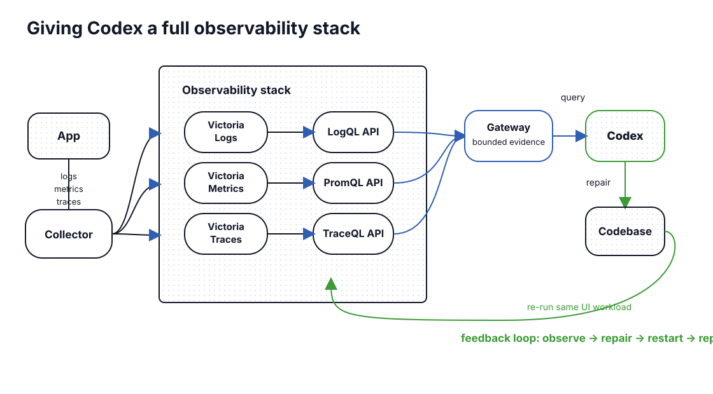
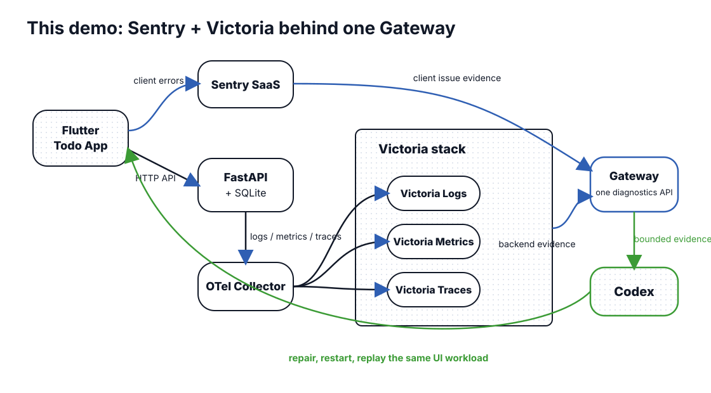

# Quick Observability Pipeline Demo

This is a local-first demo for an automated Codex repair loop.

The demo app is a Flutter Todo App backed by FastAPI and SQLite. The current
demo has only been tested by running the Flutter app on macOS. The app includes
a small script that clicks through the UI and intentionally triggers a bug. When
that bug happens, the observability stack captures the failure evidence and a
local repair process asks Codex to fix the product code.

## Demo Flow

This demo intentionally includes deterministic escaped bugs:

- Deleting a Todo whose title contains `crash` raises a backend
  `RuntimeError("todo deletion failed")`.
- Completing a Todo whose title contains `mobile-crash` raises a Flutter
  `StateError("todo completion failed")`.

The click-through script creates normal Todos first, then creates a Todo named
`backend-crash-<run_id>` and tries to delete it. That action triggers the
backend issue. The point of the demo is that Codex sees the failure through
logs, traces, metrics, and error events instead of a hard-coded test
expectation.

### Concept

The original idea is to give Codex a queryable observability stack. Codex does
not guess from a failed UI alone; it queries logs, metrics, and traces, repairs
the codebase, restarts the app, and re-runs the same scripted app interaction.



### This Demo

This repository uses a hybrid stack. The Flutter App sends client exceptions to
Sentry. The FastAPI backend sends logs, metrics, and traces through the
OpenTelemetry Collector into Victoria services. The Observability Gateway reads
both Sentry and Victoria and exposes one diagnostics API to Codex.

The Flutter App does not send logs, metrics, or traces directly into the
Victoria stack. It reaches that stack indirectly by calling the FastAPI backend,
which emits backend telemetry.



The demo has three local helpers:

- **Click-through script**: a saved set of Flutter App actions, such as typing a
  Todo title, pressing Add, and pressing Delete. In the code this is called a
  workload.
- **Diagnostics Gateway**: a read-only local API that gathers the relevant
  Sentry and Victoria evidence for Codex.
- **Repair Coordinator**: a local repair process that watches for new issues,
  starts Codex, validates the repair, and opens a pull request.

The automatic repair loop works like this:

1. Start the backend services and the Flutter App.
2. Start the Repair Coordinator. It checks the Diagnostics Gateway for recent
   failures.
3. Run the click-through script. It creates a Todo that triggers the injected
   backend crash.
4. The Flutter App and FastAPI backend emit diagnostic signals.
5. The Diagnostics Gateway collects the relevant Sentry event, backend logs,
   traces, and metrics into a small evidence bundle.
6. The Repair Coordinator creates a repair branch and starts Codex on that
   branch.
7. Codex reads the evidence, finds the product bug, and edits the app or API
   code.
8. The Repair Coordinator restarts the changed component and runs the same
   click-through script again.
9. If the scripted app interaction now passes and no new issue appears, the
   Coordinator creates a pull request for the repair.

## Run Automatic Repair

These commands use the Flutter macOS desktop target. That is the only demo
runtime tested so far.

Create local configuration:

```bash
cp .env.example .env
```

Fill in the DSN for the Flutter App and a read-only `event:read` API token for
the Diagnostics Gateway. The token is used only by that local diagnostics
service and is not passed to the Flutter process.

Terminal 1: start the backend, Diagnostics Gateway, and observability services.

```bash
./scripts/start_local.sh
```

Terminal 2: start the Flutter macOS App.

```bash
./scripts/run_flutter.sh
```

Terminal 3: start the Repair Coordinator. This is the local repair process that
watches for failures, runs Codex, validates the fix, and creates a pull
request.

```bash
./scripts/run_repair_coordinator.sh --verbose
```

Terminal 4: trigger the injected issue by running the click-through script.

```bash
RUN_ID="$(uuidgen | tr '[:upper:]' '[:lower:]')"
cd services/repair_coordinator
uv run python -m repair_coordinator run-workload \
  ../../harness/mixed_user_workload.hs.yaml \
  --run-id "$RUN_ID"
```

Stop the local stack when finished.

```bash
cd ../..
./scripts/stop_local.sh
```

## More Detail

- [Prototype Scope](docs/PROTOTYPE-SCOPE.md)
- [Repair Coordinator Acceptance](docs/REPAIR-COORDINATOR-ACCEPTANCE.md)
- [ADR 0001: Hybrid Observability Pipeline](docs/adr/0001-hybrid-observability-pipeline.md)
- [ADR 0002: Poll Gateway for Local Repair Tasks](docs/adr/0002-poll-gateway-for-local-repair-tasks.md)
